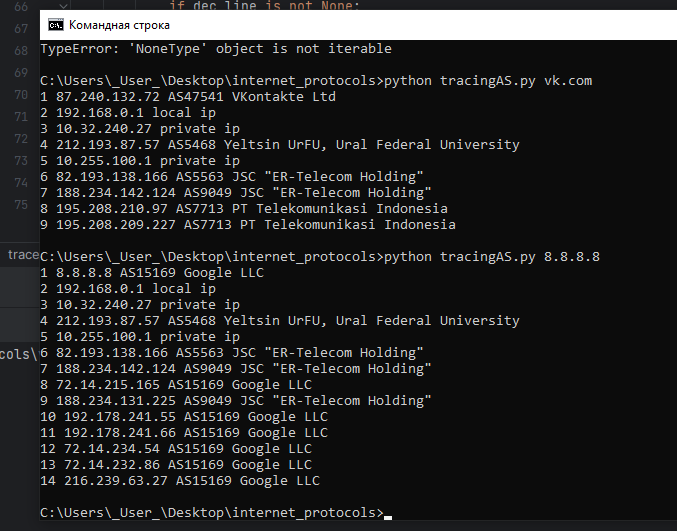
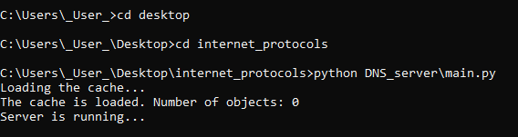
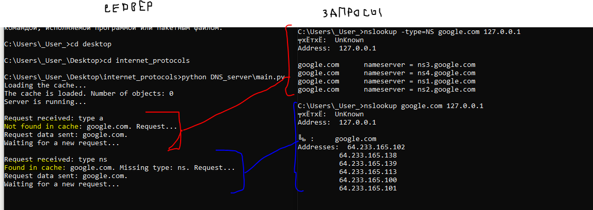
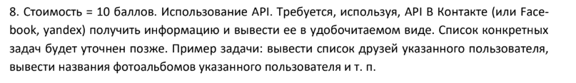
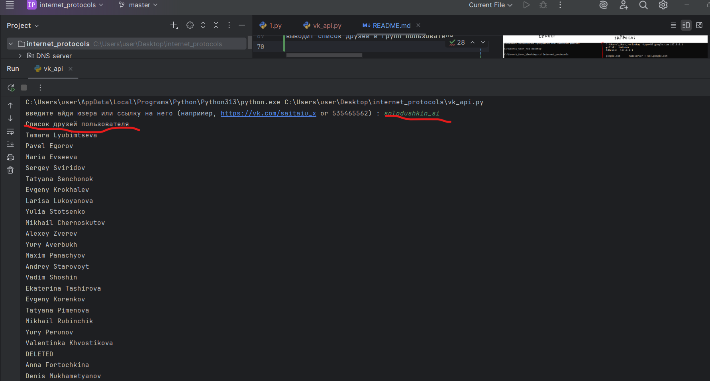
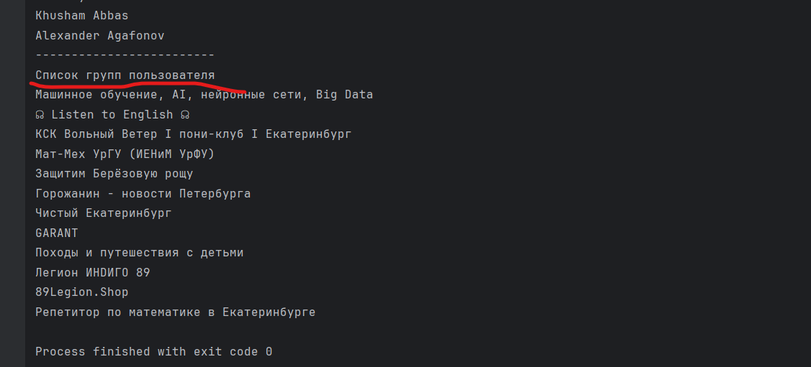

## Задача 1.
Стоимость = 8 баллов. Трассировка автономных систем. Пользователь вводит доменное имя
или IP адрес. Осуществляется трассировка до указанного узла (например, с использованием

tracert), т. е. мы узнаем IP адреса маршрутизаторов, через которые проходит пакет. Необхо-
димо определить к какой автономной системе относится каждый из полученных IP адресов

маршрутизаторов. Для определения номеров автономных систем можно обращаться к базам
данных региональных интернет регистраторов.

Выход: для каждого IP-адреса – вывести результат трассировки (или кусок результата до появ-
ления ***), для "белых" IP-адресов из него указать номер автономной системы.

В итоге должна получиться такая таблица
No по порядку    IP     AS

работа кода (кратко): 
вызов trace с параметром адреса: трассировка до указанного адреса , получение списка строк
для каждой строки вызваем decode_line : декодируем и определяем тип айпи: локальный, приватный, публичный
для первых двух выводим соответсвтующее сообщение с типом, для третьего - вызываем get_AS_info, где получаем AS 

Как пользоваться: через командную строку перейти в папку с проектом и запустить файл tracingAS.py с параметром (доменное имя
или IP адрес)
Пример использования домен и айпи:

## Задача 4. Кэширующий DNS сервер 

запуск:
либо через командную строку

либо через среду разработки

пример использования : 

краткое описание структуры программы 
(более детальное описание можно получить, обратившись к документации к классам и функциям (см. код)):

DNS_server (пакет) :

main.py :

реализация DNS-сервера

cache.py:

управление кэшем DNS-записей, включая загрузку, сохранение и обновление кэша ,
в качестве кэша выступает тестовый файл cache.txt

parser.py:

реализует классы Header, Flags и Parser, которые используются для обработки и разбора DNS-запросов 
и ответов. Он включает в себя структуры данных для заголовка DNS и флагов, а также методы 
для разбора входящих запросов

## задача 8

Программа принимает на вход либо айди пользователя, либо ссылку на него
выводит список друзей и групп пользователя

